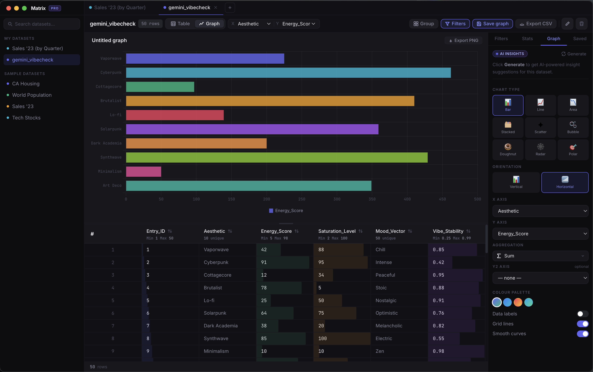

# Matrix Pro

No-code data exploration and visualisation. Built with **Vite + React + Electron + sql.js**.

Vibe coding with Claude Code.



---

## Quick start

```bash
npm install
npm run dev
```

> `npm run dev` starts Vite on port 5173 and launches Electron pointing at it.
> No native compilation required — sql.js is pure WebAssembly.

---

## Build for distribution

```bash
npm run build:mac     # → release/Matrix Pro-2.0.0.dmg  (arm64 + x64)
npm run build:win     # → release/Matrix Pro Setup 2.0.0.exe
npm run build:linux   # → release/Matrix Pro-2.0.0.AppImage
```

---

## Features

### Datasets
- Import `.csv` and `.tsv` files via drag & drop or **⌘O**
- **Paste-to-import** — copy a CSV or TSV table from any app (Excel, Google Sheets, etc.) and paste directly into Matrix Pro to create a new dataset instantly
- 4 built-in sample datasets (CA Housing, World Population, Sales '23, Tech Stocks)
- **Create blank datasets from scratch** — define column names and types upfront via the **+** button
- 5 column types: **Text · Number · Date · Boolean · Category** — auto-detected on import, overridable per column
- Closing a dataset hides it — it stays in the sidebar and can be reopened
- **Duplicate** any dataset via the ⋯ menu in the toolbar — creates a full copy as a new tab
- **Change dataset colour** — click the colour dot in the toolbar to pick from 10 palette swatches; persists to SQLite
- Rename and delete via the ⋯ menu in the toolbar
- **Cross-dataset joins** — join two open datasets on a shared key column (inner / left / right); result opens as a new tab
- **Export CSV / JSON** — exports only visible (non-hidden) rows and columns respecting active filters; **⌘E** for CSV
- Datasets, saved graphs, and workspace assignments are persisted to SQLite on Electron

### Workspaces
- Organise datasets into named workspace groups in the sidebar
- Create a workspace with **+ New workspace** at the bottom of the sidebar
- Collapse or expand each workspace section
- **⋯** menu on each workspace: inline rename or delete (datasets fall back to Uncategorized on delete)
- Move any dataset to a workspace via the folder icon that appears on hover
- Workspaces and assignments survive app restarts — stored in SQLite alongside datasets

### Table view
- Virtualised rendering — only visible rows are in the DOM; handles large datasets without slowdown
- Formatted numbers, date parsing, and categorical value pills
- Row and column count always visible in the toolbar stat pill; hidden columns shown as `N / total cols`
- **Inline cell editing** — double-click any cell to edit; Tab / Enter to move to the next cell, Esc to cancel
- **Keyboard navigation** — arrow keys to move the focused cell; Enter / F2 to enter edit mode; Delete / Backspace to clear; ⌘↵ to add a row
- **Column reordering** — drag any column header left or right to reorder; order persists to the dataset
- **Column resizing** — drag the right edge of any header
- **Freeze columns** — hover a column header and click the pin icon to freeze that column (and everything to its left); frozen columns stay fixed during horizontal scroll with a visual separator
- **Multi-sort** — click ⇅ to sort by a column; Shift+click to add more sort keys; priority indicators (↑¹ ↓²) show order; Shift+click a sorted column again to flip direction or remove it from the sort stack
- **Column rename** — double-click any column header label to rename it inline; all rows, types, and widths update automatically
- **Column type override** — click the type badge (T / # / D / B / C) in any column header to cycle through types
- **Undo / Redo** (**⌘Z** / **⌘⇧Z**) — unified 50-step history per dataset covering cell edits, row changes, and column operations (rename, reorder, freeze, type change)
- **Conditional formatting** — hover a numeric column header and click the gradient icon to apply a colour-scale background (low → transparent, high → indigo); click again to turn off; replaces the bar-chart overlay for a cleaner heatmap view
- **Find & Replace** — **⌘F** to find (prev/next with Shift+Enter / Enter); **⌘H** to open replace panel; Replace current or Replace All with full undo support; matching cells highlighted amber, active match outlined
- Numeric columns reject non-numeric input with a shake animation
- Add rows with **⌘↵** or the footer button; delete rows by hovering the row number and clicking ×
- Category columns auto-assign distinct colours to each unique value
- Boolean columns render as green/red pills
- **Row selection** — click the row index to select a row; Shift+click for range select; ⌘+click to toggle; ⌘A to select all visible rows
- **Bulk actions** — duplicate, copy as TSV to clipboard, or delete selected rows from the action bar
- Active filters shown as chips with one-click removal
- Column visibility toggle — hide/show individual columns via the toolbar; search by name for wide datasets
- Group & aggregate — create a new summarised dataset by category

### Filters & Stats (⌘\\)
- **Numeric filters** — range sliders with min/max bounds per column
- **Category filters** — checkbox list for each unique value
- **Date filters** — year and month multi-select plus an optional date range
- **Text / Regex filters** — Contains · Starts with · Ends with · Regex modes, with optional case-sensitive toggle; regex mode uses a monospace input and shows inline error messages
- **Saved filter sets** — save the current combination of active filters as a named set; reload or delete saved sets at any time; filters are fully serialisable (survive reloads and cross-session use)
- Active filter chips shown in the table toolbar for quick removal
- **Stats panel** — per-column statistics cards showing type, value count, completeness bar, and (for numeric columns) a mini 16-bucket distribution histogram coloured by the active palette

### Graph view
- 9 chart types: Bar, Line, Area, Stacked, Scatter, Bubble, Doughnut, Radar, Polar
- Bar charts support vertical and horizontal orientation
- Dual Y-axis: categorical Y2 → grouped multi-series bars; numeric Y2 → line overlay on second axis
- 4 colour palettes, grid toggle, smooth curves toggle
- Export any chart as PNG
- Save and reload named graph configurations per dataset

### SQL Editor (⌘3)
- Full in-browser SQL powered by sql.js (WebAssembly)
- Every open dataset is automatically loaded as a queryable table
- Cross-dataset `JOIN`s supported
- Schema sidebar with collapsible tables and column type badges — click any name to insert it
- `⌘↵` to run · Tab to indent · results show row count and execution time
- **Open as dataset** — turn any query result into a new tab

### AI Insights
- Connects to a locally-running Ollama instance to generate chart suggestions for the active dataset
- Works fully offline without Ollama — shows a retry prompt if unavailable

---

## Keyboard shortcuts

| Shortcut | Action                                    |
|----------|-------------------------------------------|
| ⌘O       | Open dataset file                         |
| Paste    | Import clipboard CSV/TSV as new dataset   |
| ⌃Tab     | Next open dataset                         |
| ⌃⇧Tab    | Previous open dataset                     |
| ⌘1       | Table view                                |
| ⌘2       | Graph view                                |
| ⌘3       | SQL Editor                                |
| ⌘\\      | Toggle filter panel                       |
| ⌘F       | Find in table                             |
| ⌘H       | Find & Replace                            |
| ⌘Z           | Undo last edit / column operation              |
| ⌘⇧Z          | Redo                                           |
| ⌘↵           | Add row (table view) · Run query (SQL)         |
| ⌘A           | Select all visible rows                        |
| ⌘S           | Save current graph                             |
| ⌘E           | Export CSV                                     |
| Shift+click ⇅ | Add column to multi-sort (or flip/remove)     |
| Esc          | Close modal / cancel edit / clear selection    |

---

## Ollama AI Insights

```bash
# Install Ollama
brew install ollama          # macOS
# or https://ollama.com

# Pull a model
ollama pull llama3.2         # recommended

# Ollama auto-starts on localhost:11434
```

Click **Generate** in the Graph → AI Insights panel.

---

## Data persistence

All app data is stored in a single SQLite file:

| Platform | Location |
|----------|----------|
| macOS    | `~/Library/Application Support/matrix-pro/matrix-pro.db` |
| Windows  | `%APPDATA%\matrix-pro\matrix-pro.db` |
| Linux    | `~/.config/matrix-pro/matrix-pro.db` |

The database stores datasets (rows, columns, open/close state), saved graph configurations, and workspace definitions and assignments. Everything is restored automatically on next launch. Deleting all datasets returns the app to the Welcome screen.
